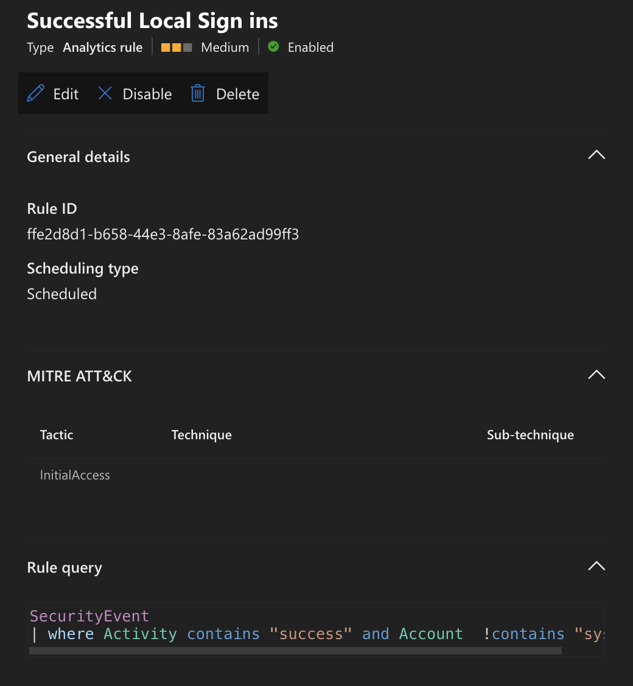
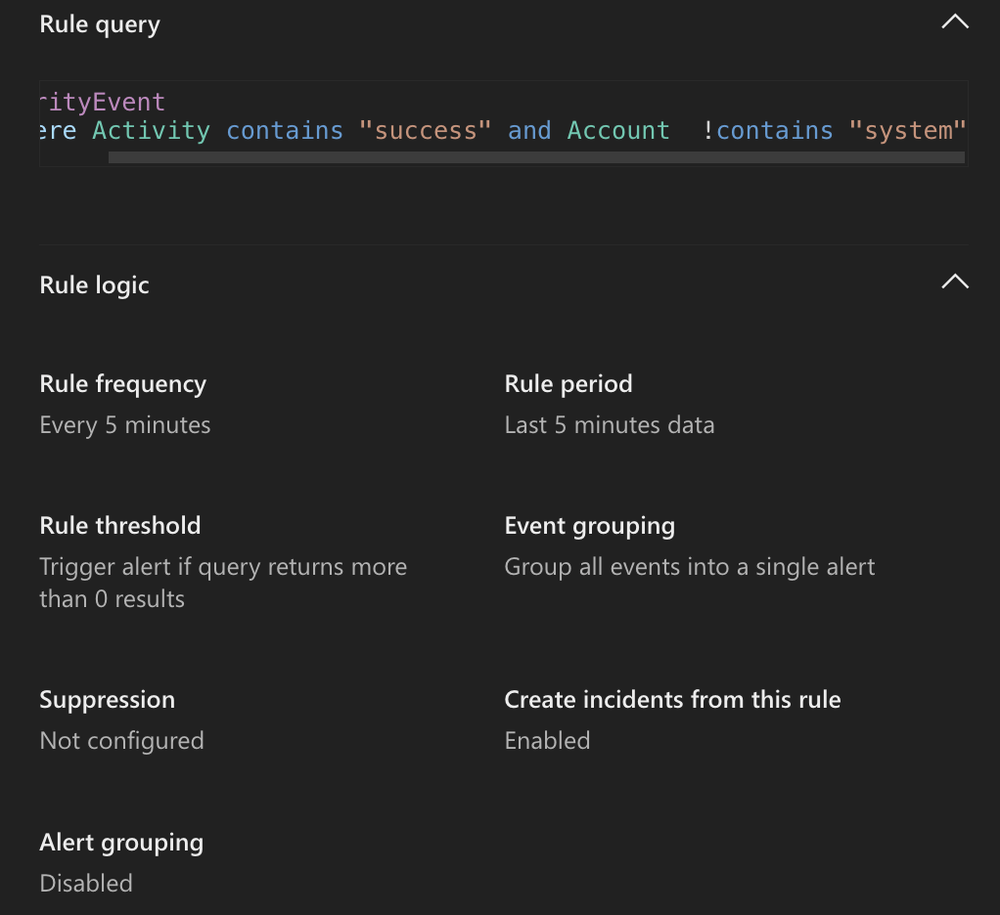
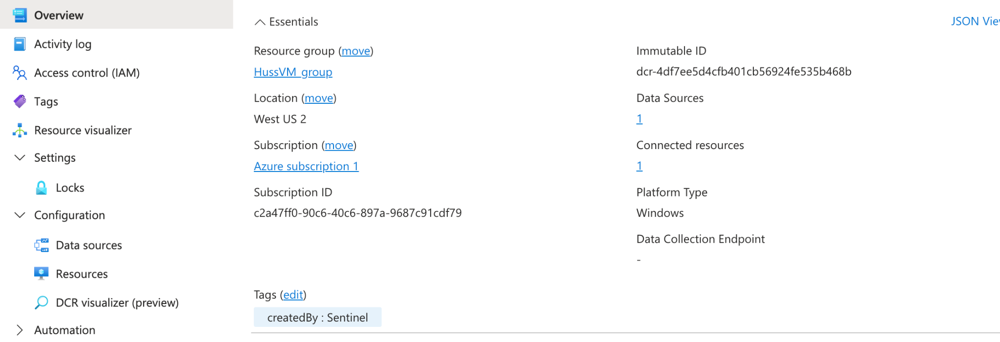
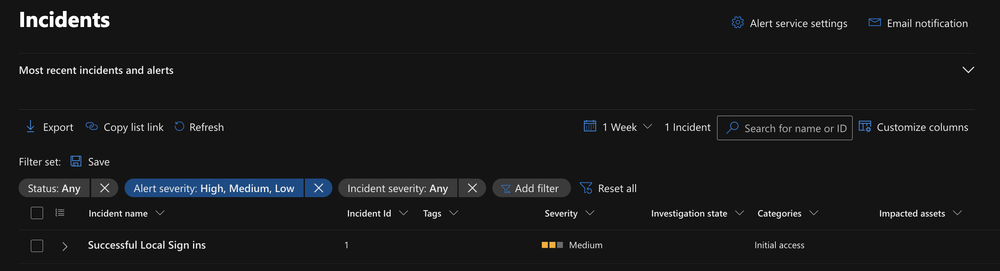
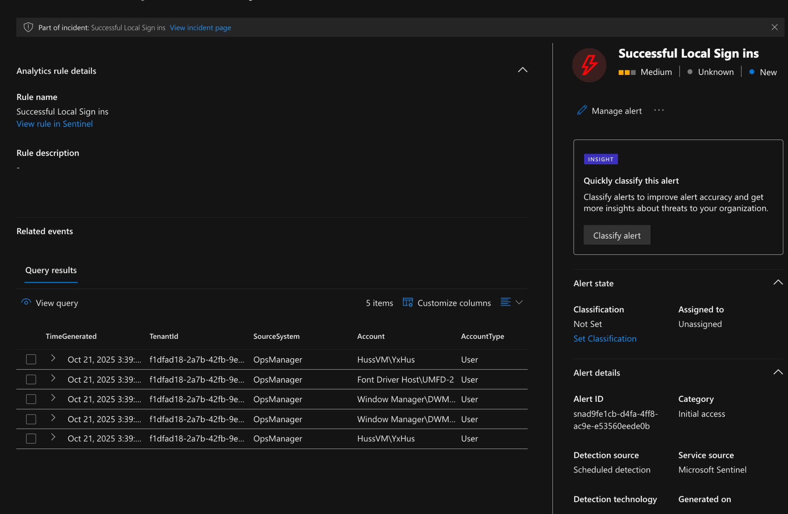
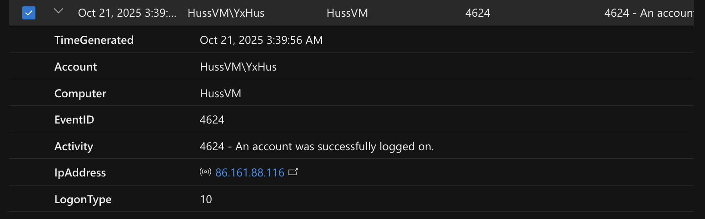

# 🛡️ Microsoft Sentinel SIEM Detection Project

This project demonstrates an end-to-end **Security Information and Event Management (SIEM)** workflow using **Microsoft Sentinel** and a Windows VM in **Microsoft Azure**.  
It covers data ingestion, custom analytic rule creation (KQL), alert generation, and incident investigation — replicating a Tier-1 SOC workflow.  
All findings are supported by real log data and screenshots.

---

## Honeypot Overview

This lab uses a simple **RDP honeypot**: a purpose-built, monitored Windows VM exposed for testing. The VM accepts RDP connections while telemetry (Windows Security and Application logs) is forwarded to the Log Analytics workspace via the Azure Monitor Agent and a Data Collection Rule.  
The honeypot’s purpose is to safely attract and record authentication activity (legitimate tests and any automated scanning/attacks), validate detection logic, and collect actionable telemetry for investigation and threat-intelligence enrichment. All activity is contained within the lab environment and logged in Sentinel for analysis.

---

## ⚙️ Architecture Overview

The environment consists of a Windows VM connected to a Log Analytics Workspace and Microsoft Sentinel via the **Azure Monitor Agent (AMA)**.

**Data Flow:**
1. Windows VM generates Security & Application logs.
2. **AMA** forwards logs to **Log Analytics** via a **Data Collection Rule (DCR)**.
3. **Microsoft Sentinel** analyzes data using **KQL** analytic rules.
4. Matching activity triggers **alerts** and **incidents** for investigation.

*(Architecture diagram to be added in a future update.)*

---

## 🔍 Detection Rule: Successful Local Sign-ins

A custom analytic rule detects **successful RDP logons**: **Event ID 4624** with **LogonType 10 (RemoteInteractive)**.  
The rule runs every 5 minutes over the last 5 minutes of data and auto-creates incidents.

**Rule Summary**  

**Rule Logic**  

**Data Collection Rule (DCR)**  

---

## 🚨 Alert Trigger & Investigation

After an RDP login to the VM, the **Successful Local Sign-ins** rule triggered an alert and generated a Sentinel incident (MITRE ATT&CK: *Initial Access*).

**Incident Overview**  

**Alert Details**  

---

## 🧾 Log Evidence

The correlated Windows security logs confirm a real RDP session:

| Field | Value |
|-------|-------|
| **Account** | HussVM\YxHus |
| **Computer** | HussVM |
| **EventID** | 4624 |
| **Activity** | An account was successfully logged on |
| **IpAddress** | (external IP recorded) |
| **LogonType** | 10 (RemoteInteractive) |

**Raw Event Evidence**  

---

## 📊 Findings

- Ingestion from Azure VM to Sentinel verified via **AMA + DCR**.  
- Custom KQL analytic rule correctly detected **successful RDP sign-ins**.  
- Sentinel created an incident and correlated the triggering events for investigation.  

---

## 🚀 Next Steps

- **Integrate Threat Intelligence (MISP → Sentinel):** Deploy MISP via Docker and ingest open-source feeds to enrich detections.  
- **Expand Detections:** Add failed logons (4625) and a brute-force correlation rule.  
- **Automation & Visualization:** Logic App playbook for enrichment/notifications and a Workbook dashboard for sign-in trends.

---

## 🧠 Tools & Technologies

- **Microsoft Azure** (VMs, Log Analytics, DCR)  
- **Microsoft Sentinel** (Analytics, Incidents, KQL)  
- **Azure Monitor Agent (AMA)**  
- **RDP** (Remote Desktop Protocol)

---

## 📁 Repository Structure

.
├── kql_rules/
│ ├── brute_force_detection.kql
│ └── brute_force_test.kql
├── scripts/
│ └── generate_test_events.ps1
├── screenshots/
│ ├── 1_detection_rule/
│ │ ├── sentinel_lab_dcr.png
│ │ ├── sentinel_lab_dcr_overview.png
│ │ ├── sentinel_rule_summary.png
│ │ └── sentinel_rule_logic.png
│ ├── 2_incident/
│ │ ├── incident_overview.png
│ │ └── incident_alert.png
│ └── 3_logs/
│ └── log_query_results.png
├── reports/
│ └── incident_summary.md
└── README.md
---

## ✍️ Author

**Yusuf Hussain** — London, UK  
📧 yusufhussain2003@hotmail.com  
🔗 LinkedIn: [add link] · GitHub: [add link]

---

### 🧾 License
This project is for educational and demonstration purposes only.
